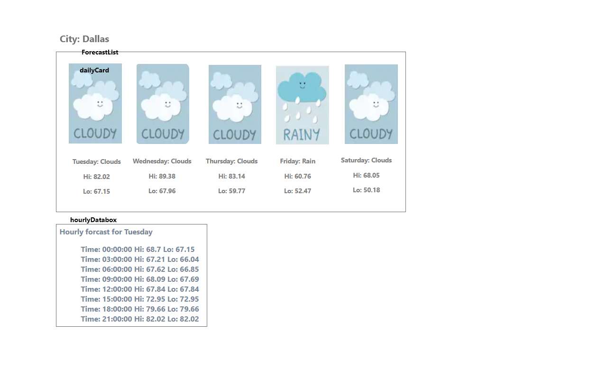

# weather-app
# 
# Homework: W3D5: Weather App
##### A weather app to provide daily and hourly forecast.
# 
# Wireframe

# 
### Features: 
#### Weather data is obtained from Open Weather Map
#### Axios is used to implement AJAX query
#### React Router is used to link to 6 components. Each day component renders the hourly data for that day
#####    5 Day/3 Hour data is requested from OWM service on-demand using Axios
#####    
#####    Data for city of Dallas is used
#####    Images are use to indicate forecast. Currently support: cloudy, rainy, sunny, snowy forecast.
#####    Daily hi/lo temps are included below the weather images.
#####    Temperatures listed are in fahrenheit.
#####    Clicking an image reveals the hourly forecast for that day. OWM provides forecasts in 3 hour time block. 
##### Note: Forecast data from OWM sometimes provide a 6th day forecast. This happens when the next day starts within 6 hours from current time.